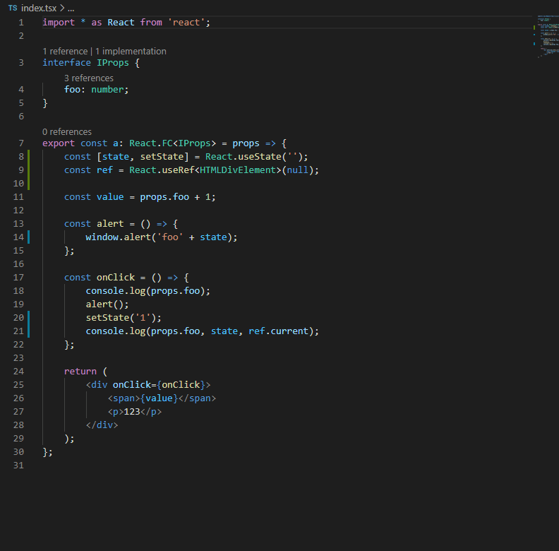

# ts-react-hooks-tools

A tools who provide a series of refactors about react hooks. Build with ❤️.

### Install
- [As TypeScript Plugin](https://www.npmjs.com/package/ts-react-hooks-tools)  
- [As VSCode extension](https://marketplace.visualstudio.com/items?itemName=kingwl.ts-react-hooks-tools) 

### Motivation

- Wrap expression into `React.useMemo()`
- Wrap function like into `React.useCallback()`
- Detect dependencies and constants automatic.

### Usages

